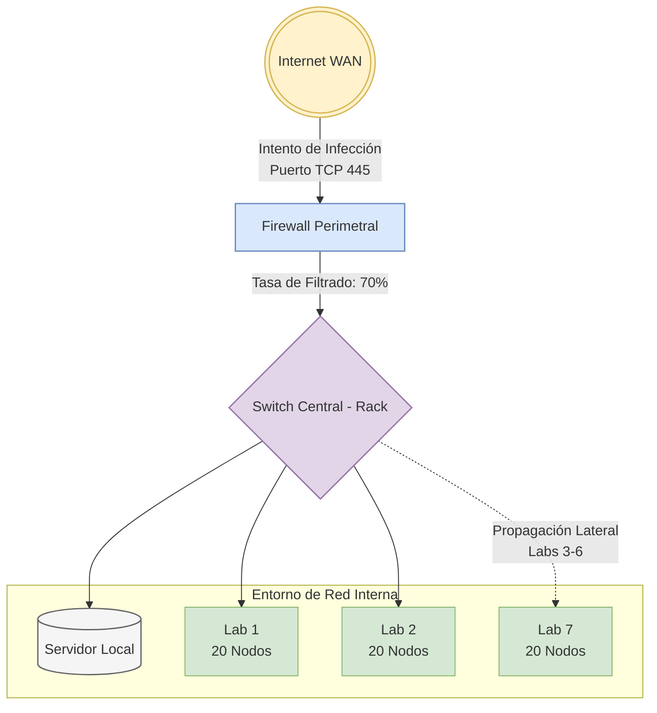
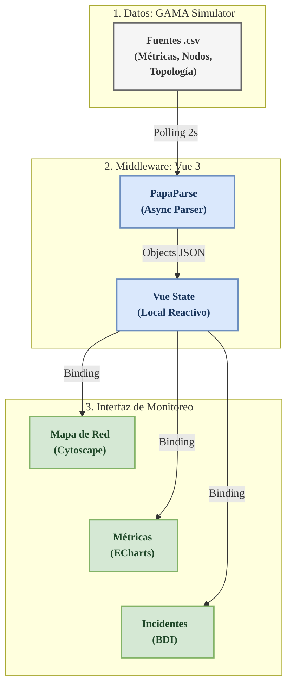

# Códigos Mermaid para Diagramas Académicos (Optimizados para Dos Columnas)

El formato de dos columnas de IEEE Access requiere que las figuras sean **horizontales** (más anchas que altas) o muy compactas para evitar desbordes o desperdicio de espacio vertical. 

A continuación se presentan tres opciones optimizadas que puede exportar en formato JPG o PNG desde [Mermaid Live Editor](https://mermaid.live/) y colocar en su directorio `oficial/images/`.

---

## 1. Rediseño Horizontal de la Arquitectura de Red
Este diseño utiliza una distribución de izquierda a derecha (`graph LR`) en lugar de vertical. Se consolida el flujo para que el aspecto sea alargado (horizontal) y quepa dentro del ancho de una columna (`\columnwidth`) sin superar los 3.5 cm de altura en el PDF.

**Nombre sugerido para guardar:** `arquitectura_red.png`



---

## 2. Diagrama de Transición de Estados del Agente (FSM)
Este diagrama de máquina de estados describe de forma muy compacta cómo transita un nodo/PC entre los diferentes estados de la simulación. Es cuadrado y encaja en cualquier sección del artículo (por ejemplo, en la Sección III. Metodología).

**Nombre sugerido para guardar:** `estados_agente.png`

```mermaid
stateDiagram-v2
    classDef default fill:#f9f9f9,stroke:#333,stroke-width:1px;
    
    [*] --> Sano : Inicialización
    
    state Sano {
        [*] --> Susceptible
    }
    
    Susceptible --> Infectado : Ataque Exitoso<br/>U(0,1) < P(i->j)
    Susceptible --> Protegido_Aislado : Contingencia Activa<br/>(Infección >= 30%)
    
    Infectado --> [*] : Cifrado Completo
    Protegido_Aislado --> [*] : Inmunizado
```

---

## 3. Diagrama de Flujo del Motor de Infección (Decisión)
Este diagrama describe la lógica probabilística por cada intento de infección desde un nodo comprometido hacia un vecino. Sirve para enriquecer la explicación de la Sección III-C (Motor Matemático).

**Nombre sugerido para guardar:** `flujo_infeccion.png`

```mermaid
flowchart TD
    classDef default fill:#f9f9f9,stroke:#333,stroke-width:1px;
    classDef check fill:#dae8fc,stroke:#6c8ebf,stroke-width:1.5px;
    classDef action fill:#d5e8d4,stroke:#82b366,stroke-width:1.5px;
    classDef block fill:#f8cecc,stroke:#b85450,stroke-width:1.5px;

    Start([Vecino Seleccionado]) --> IsolCheck{¿Está Aislado o Asegurado?}:::check
    IsolCheck -- Sí --> Block[Infección Bloqueada]:::block
    IsolCheck -- No --> PortCheck{¿Puerto 445 Abierto?}:::check
    
    PortCheck -- No --> Block
    PortCheck -- Sí --> CalcProb[Calcular Probabilidad P_inf<br/>Atenuada por Firewall y Parcheo]:::action
    
    CalcProb --> RollCheck{¿U(0,1) < P_inf?}:::check
    RollCheck -- No --> Block
    RollCheck -- Sí --> Infect[Infectar Host]:::action
```

---

## 4. Diagrama del Dashboard de Monitoreo y Flujo de Datos
Este diagrama representa la arquitectura interna de la aplicación frontend en Vue 3 y el flujo dinámico de datos desde la simulación en GAMA Platform hasta los gráficos temporales y topológicos de la interfaz. Representa conceptualmente lo mostrado en la **Figura 4** (curvas de propagación, parches e intenciones BDI).

**Nombre sugerido para guardar:** `curvas_simulacion.png` o `dashboard_flow.png`


